# 概述
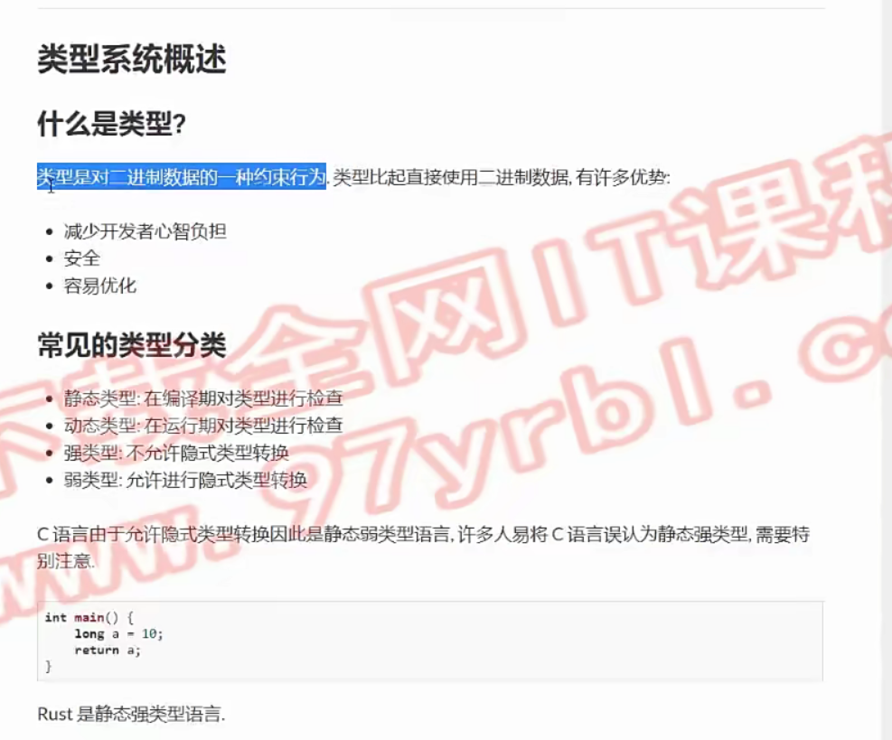
# 变量和可变性
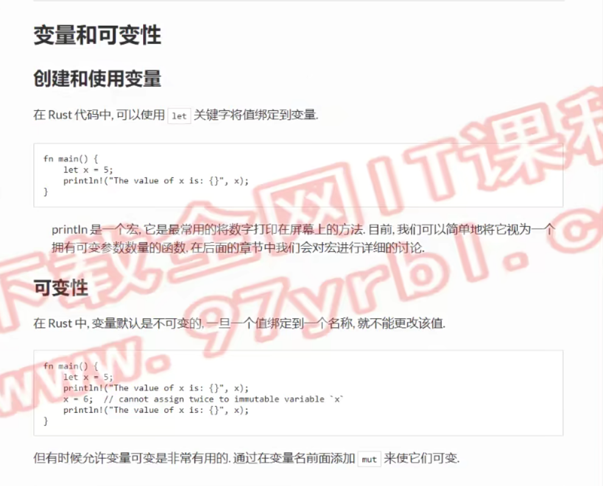
```rust
// 常量，可以定义在任何位置
// 常量和不可变变量：
//      常量在编译期求值
//      不可变变量在运行时求值
const A_CONST:i32 = 42 + 2 * 2; 
// 函数是在运行实际计算
fn get_num() -> i32 {
    420
}
fn main() { 
    let mut x = 5;      
    // println是宏，使用时需要加！
    println!("x = {}",x);
    // rust里，变量值默认不能更改,除非定义时加上mut
    x = 6;
    println!("x = {}",x);

    println!("A_CONST: {}",A_CONST);

    // 不能把函数返回值作为常量定义 -> 运行时和编译期...
    // const a = get_num();
    // 可以把函数返回值作为不可变量定义
    let a = get_num();
    println!("a = {}",a);

    // 隐藏：新声明的变量会把旧变量（同名）隐藏(不可用)
    let s = 1;
    let s = s + 100;
    let s = s - 99;
    println!("s = {}",s);
}   
```
# 基础数据类型

> usize会根据操作系统位数不同而自动设定为i32或i64, 不同位数的区别是寻址的区别，所以推荐在表示数组下标时，使用usize

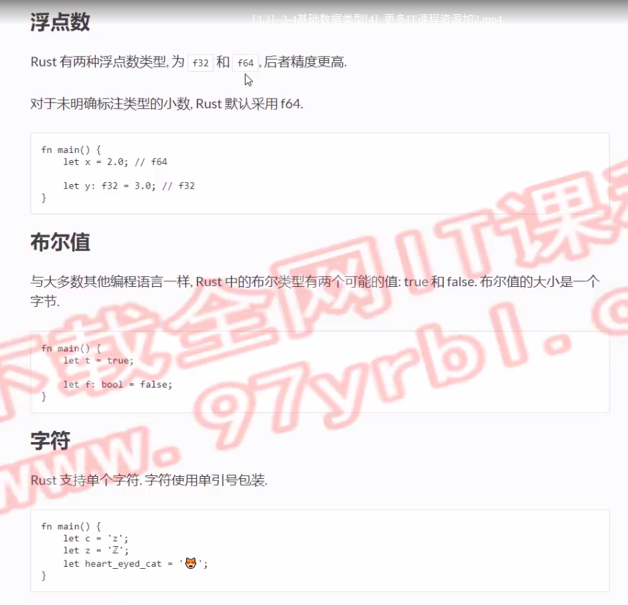

> rust字符是utf-8编码

```rust
fn main() {
    let c = 'z';
    let z = 'Z';
    let qw = '🐸';
    println!("c = {},z = {},qw = {}",c,z,qw);
}
```

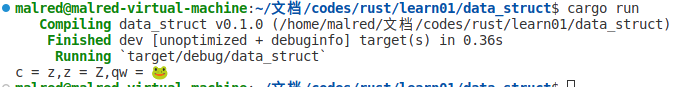
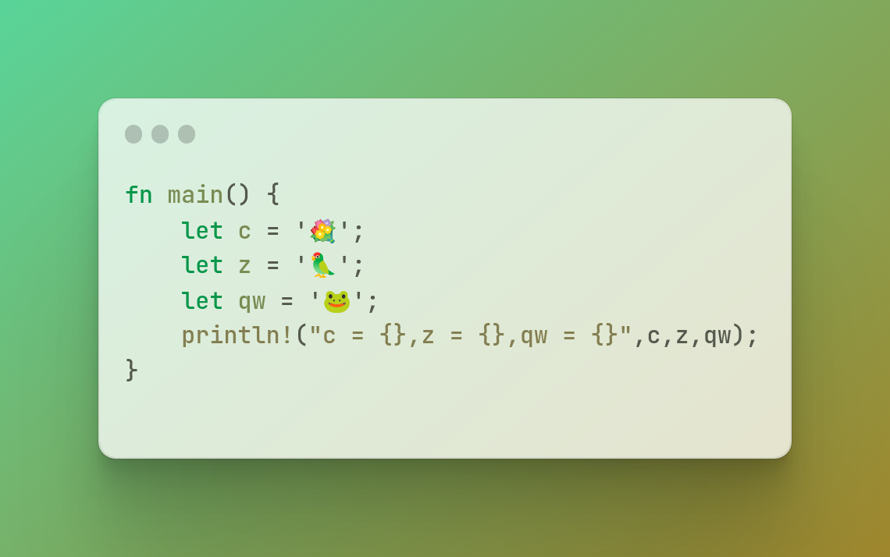

## 作业
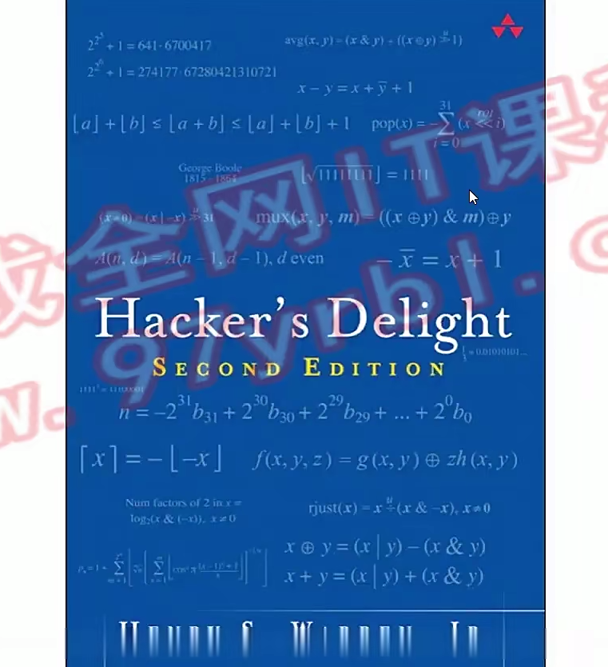
```rust
// 整数溢出
fn avg(a:u32,b:u32)->u32{   
     (a&b)+((a^b)>>1)
}
fn main(){
    assert_eq!(avg(4294967295,4294967295),4294967295);
    assert_eq!(avg(0,0),0);
    assert_eq!(avg(10,20),15);
    assert_eq!(avg(4294967295,1),2147483648);
    println!("passed!");
}
```
# 整数溢出
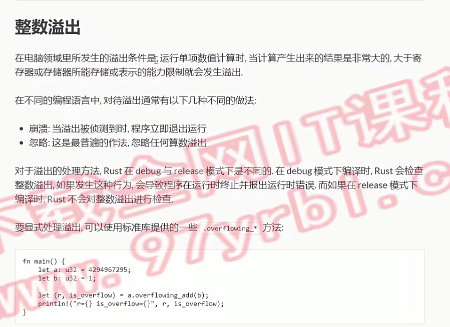
```rust
// 整数溢出
fn main(){
    let a:u32=4294967295;
    let b:u32=1;
    // 两个变量都已知，会在编译期直接计算出来
    let sum=a+b;
    println!("sum={:?}",sum)
}
```
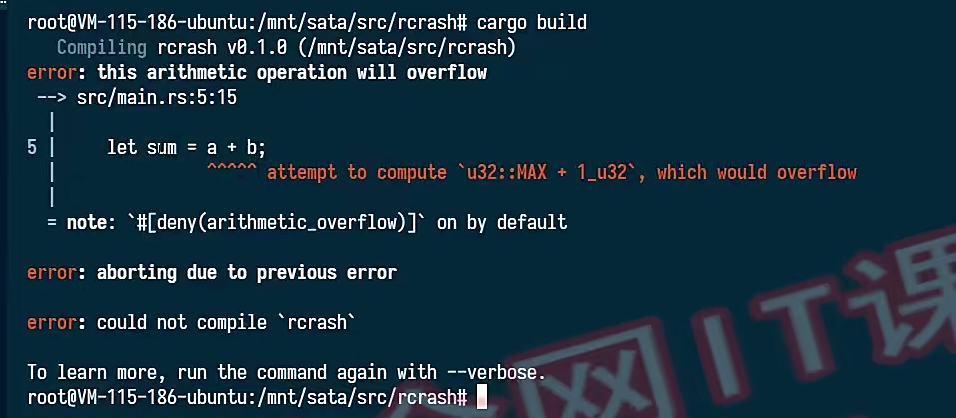
```rust
// 整数溢出
fn main(){
    // unwrap: 遇到异常直接退出程序
    // 转u32，让a+b不要在编译期计算
    let a:u32="4294967295".parse::<u32>().unwrap();
    let b:u32=1;
    let sum=a+b;
    println!("sum={:?}",sum)
}
```
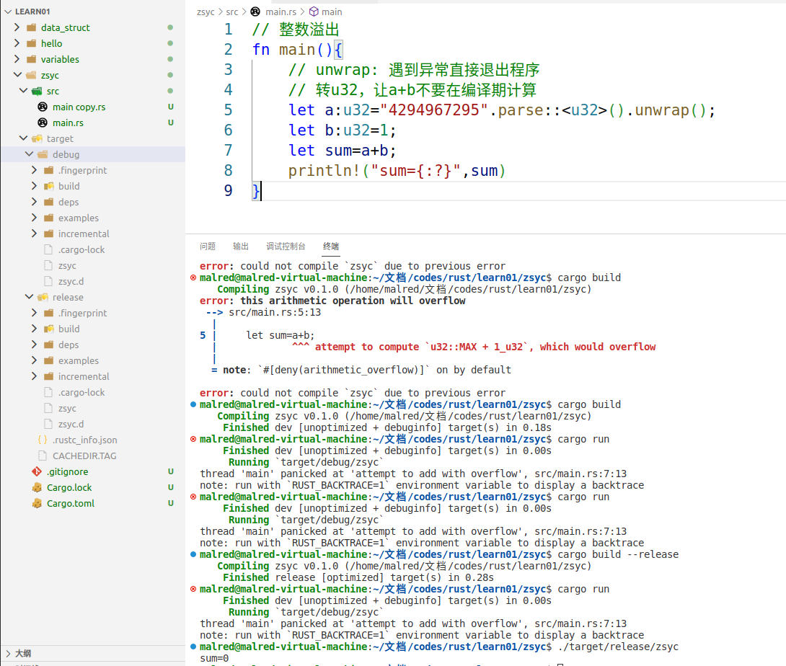
## 使用内置函数防止崩溃
```rust
// 整数溢出
fn main(){
    // unwrap: 遇到异常直接退出程序
    // 转u32，让a+b不要在编译期计算
    let a:u32="4294967295".parse::<u32>().unwrap();
    let b:u32=1;
    // let sum=a+b;
    // 使用该方法防止溢出
    // is_overflow 代表有没有溢出
    let (sum,is_overflow) = a.overflowing_add(b);
    println!("sum={:?},is_overflow={:?}",sum,is_overflow);
}
```
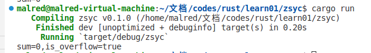
```rust
// 整数溢出
fn main(){
    // unwrap: 遇到异常直接退出程序
    // 转u32，让a+b不要在编译期计算
    let a:u32="4294967295".parse::<u32>().unwrap();
    let b:u32=2;
    // let sum=a+b;
    // 使用该方法防止溢出
    // is_overflow 代表有没有溢出
    // let (sum,is_overflow) = a.overflowing_add(b);
    let (mul,is_overflow) = a.overflowing_mul(b);
    println!("mul={:?},is_overflow={:?}",mul,is_overflow);
}
```
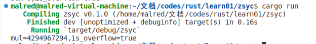
# 元组
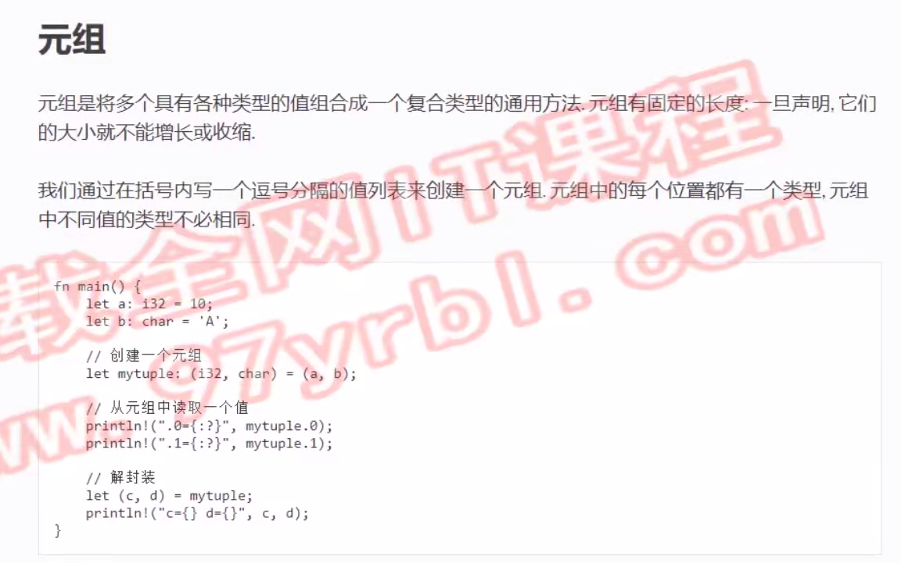
```rust
fn main(){
    let a:i32 = 18;
    let b:char = 'A';
    // 元组
    let mytuple = (a,b);
    let mytuple:(i32,char) = (a,b); // 显式声明类型
    println!("{}:{}",mytuple.0,mytuple.1);
    // 解封装
    let (c,d) = mytuple;
    println!("c={},d={}",c,d);
    // 函数返回值可以用元组
    let (res,is_overflow)=a.overflowing_add(10);
    println!("{} {}",res,is_overflow);
}
```
# 数组
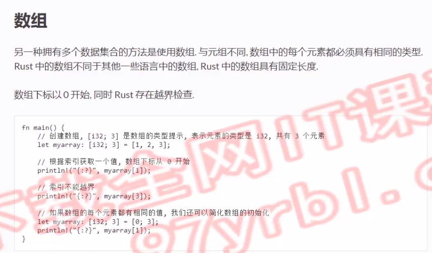
```rust
fn main() {
    // let myarr = [1,2,3,4,5];
    let myarr:[u32;5] = [1,2,3,4,5];
    println!("{}",myarr[1]);
    // 编译时错误(cargo build),数组越界
    // println!("{}",myarr[5]); 
    // 字符串转数字然后使用变量来表示下标，通过了编译时的检查
    // let index = "5".parse::<usize>().unwrap();
    // println!("myarr[5] = {}",myarr[index]);
    // 运行编译后的文件 ./target/debug/项目名 
    // 变成运行时错误
    // thread 'main' panicked at 'index out of bounds: the len is 5 but the index is 5', src/main.rs:9:30
    // note: run with `RUST_BACKTRACE=1` environment variable to display a backtrace
    
    // 定义一个每个元素都相同的数组
    let mut mybuffer:[u32;32*1024]=[0;32*1024];
    println!("mybuffer[1024]={}",mybuffer[1024]);

    // 修改数组里的元素(需要定义时加mut)
    mybuffer[1024] = 1;
    println!("mybuffer[1024]={}",mybuffer[1024]);
}
```
# 切片
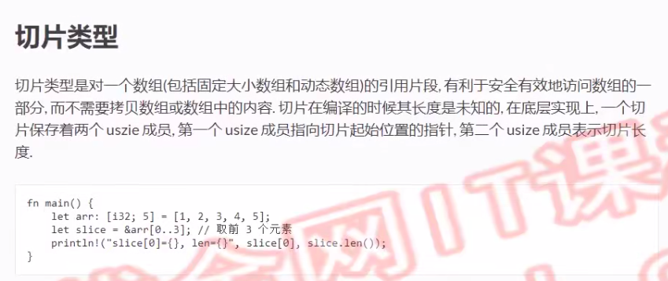
```rust
fn main() {
    let mut arr:[i32;5]=[1,2,3,4,5];
    let slice = &arr[0..3]; // .. 是range语法,&是引用符号
    // slice[0] = 1,size = 3
    println!("slice[0] = {},size = {}",slice[0],slice.len());

    let slice2 = &arr[3..5];
    println!("slice2[0] = {},size = {}",slice2[0],slice2.len());

    // 建议非空判断用is_empty(),而不算len()==0
    println!("{}",slice2.is_empty());

    // 改变切片的元素的值，会改变引用源对应的值
    let mut slice3 = &mut arr[..];
    slice3[0] = 6;
    println!("arr[0]={}",arr[0]);
}
```
# 结构体
> rust是多编程范式的语言，支持面向对象、面向过程、函数式编程

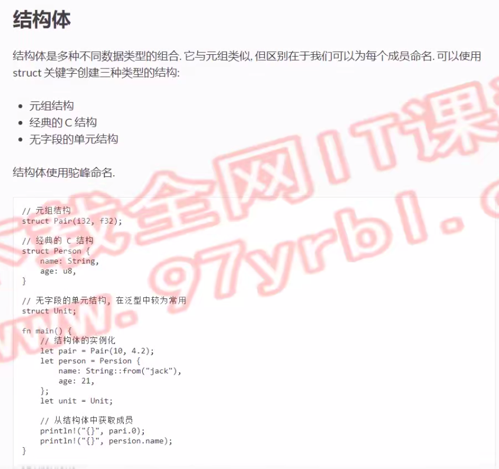
```rust
// 元组结构
struct Pair(i32,f32);
// 标准的c结构
#[derive(Debug)] // 派生属性(编译期语法) -> 编译期决定输出的内容
struct Person{
    name: String,
    age: u32,
}
// 单元结构(无字段) 在泛型里有用，但是总体用得少
struct Unit;

fn main() {
    let pair = Pair(10,4.2);
    println!("{} {}",pair.0,pair.1);

    let jack=Person{
        name: String::from("jack"),
        age: 6,
    };
    println!("{:?}",jack);
    // println!("name={} age={}",jack.name,jack.age);

    let unit = Unit;
}
```
# 枚举
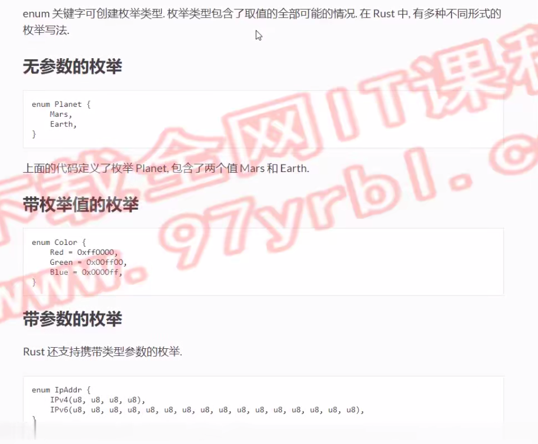
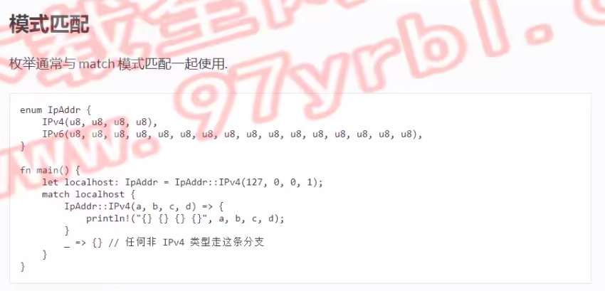
```rust
enum IpAddr {
    Ipv4(u8,u8,u8,u8),
    Ipv6(u8,u8,u8,u8,u8,u8,u8,u8,u8,u8,u8,u8,u8,u8,u8,u8),
}
fn main() {
    let localhost: IpAddr = IpAddr::Ipv4(127,0,0,1);
    match localhost{
        // 如果是Ipv4类型，解封装到a b c d
        IpAddr::Ipv4(a,b,c,d) => {
            println!("{} {} {} {}",a,b,c,d);
        }
        // 如果不是IpAddr的Ipv4类型:
        _ => {}
    }
}
```
