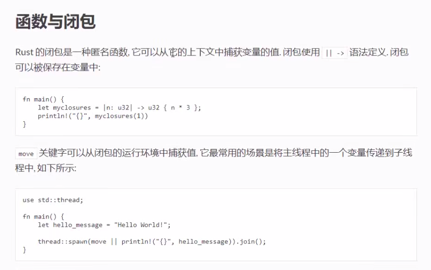

# 闭包

```rust
use std::thread;
fn main() {
    let time3=|n:u32|->u32 {n*3};
    println!("{}",time3(10));
    // move: 将环境中的值移动到闭包内部
    // 场景：多线程->从主线程移动值到子线程
    let hello="hello world";
    thread::spawn(move ||{
        println!("{}",hello)
    }).join(); // join：持续等待,直到主线程退出
}
```
