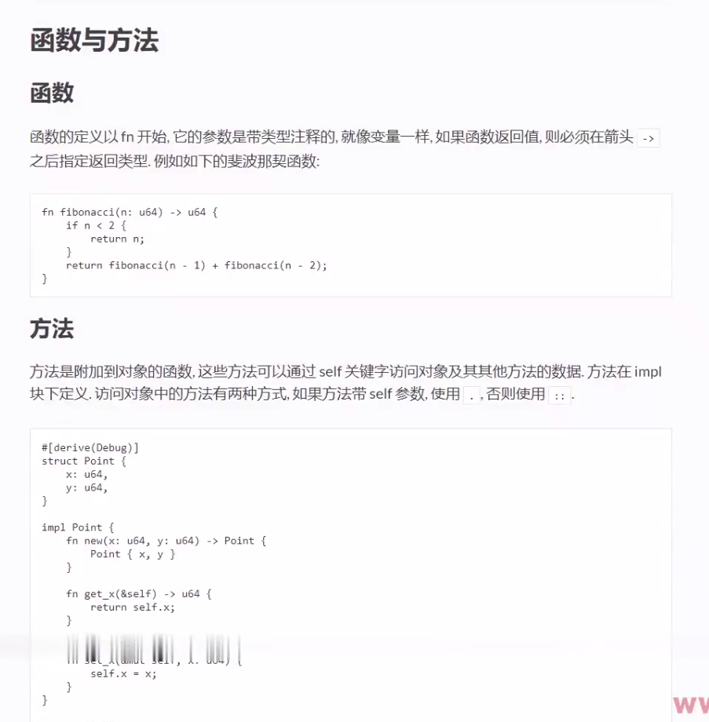

# 函数与方法

```rust
// 函数
fn fibonacci(n:u64)->u64{
    if n<2{
        n
    }else{
        fibonacci(n-1)+fibonacci(n-2)
    }
}
// 方法是附加在结构体上的函数
#[derive(Debug)]
struct Point{
    x:u64,
    y:u64,
}
impl Point{
    // 构造方法(rust里没有特别区分构造方法，只是约定方法名为new就是构造方法)
    fn new(x:u64,y:u64)->Point{
        Point{x,y}
    }
    fn get_x(&self)->u64{
        self.x
    }
    fn set_x(&mut self,x:u64){
        self.x=x
    }
}
fn main() {
    println!("{:?}",fibonacci(10));
    let mut p = Point::new(10,20);
    println!("{:?}",p);
    println!("{:?}",p.get_x());
    p.set_x(30);
    println!("{:?}",p.get_x());
}
```
