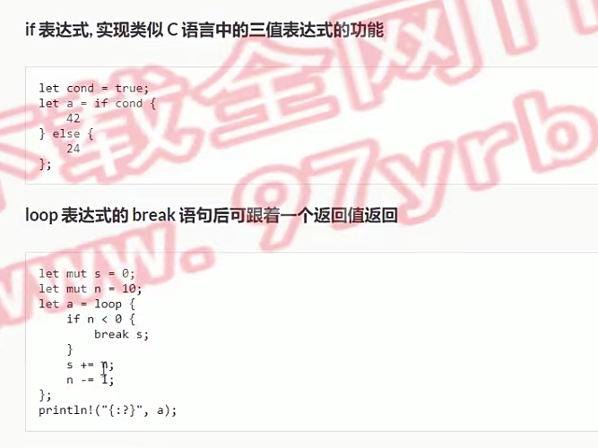
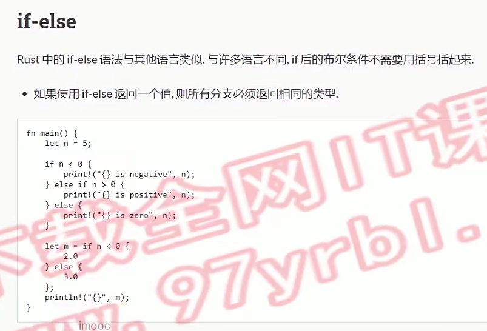
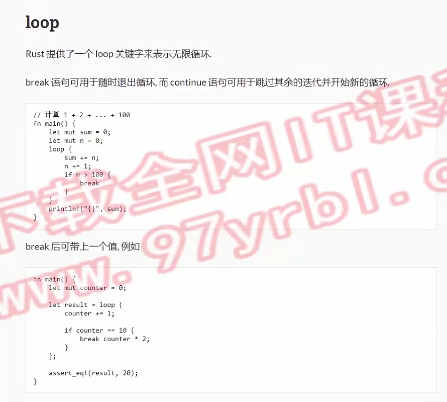
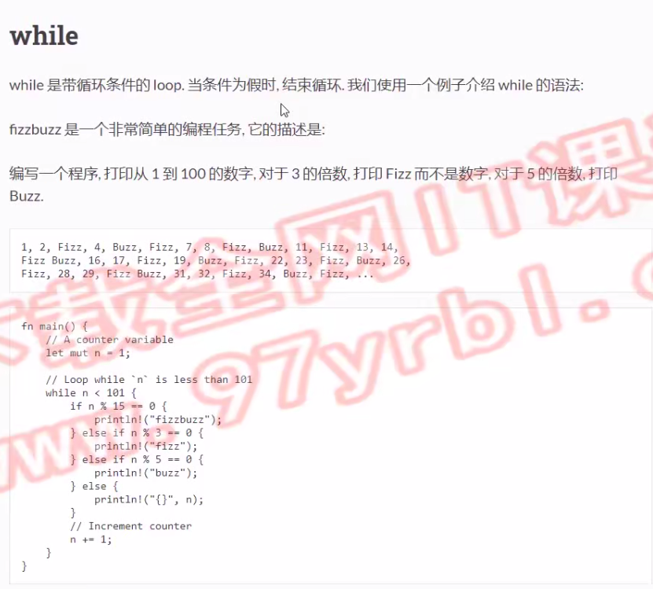
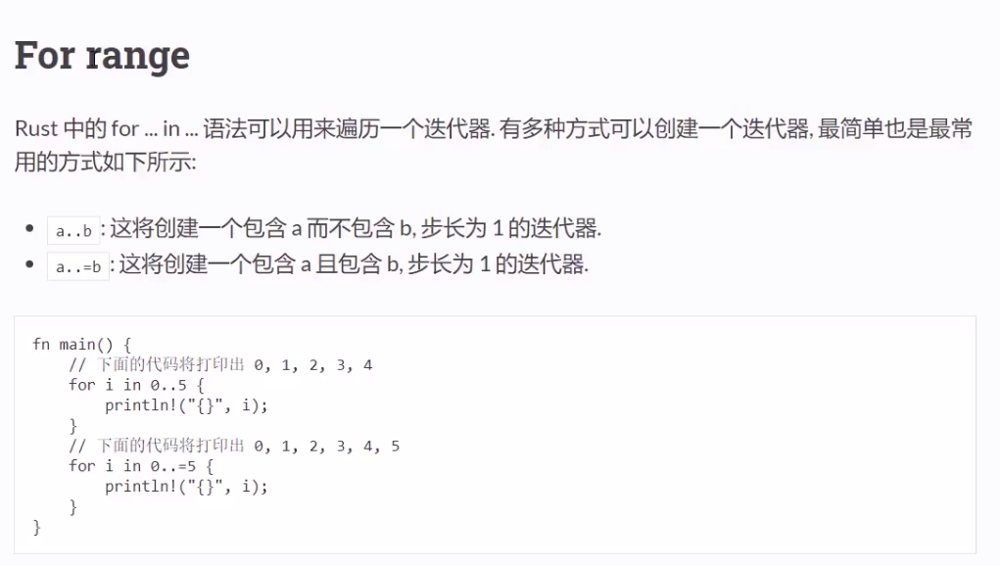
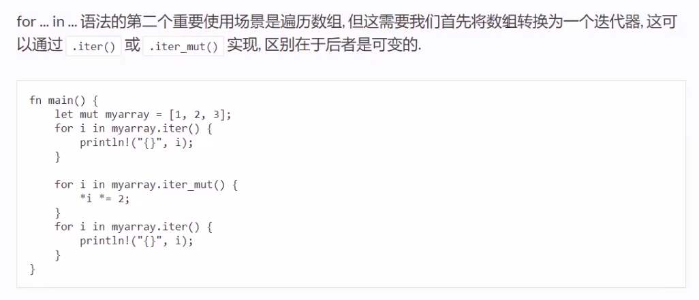
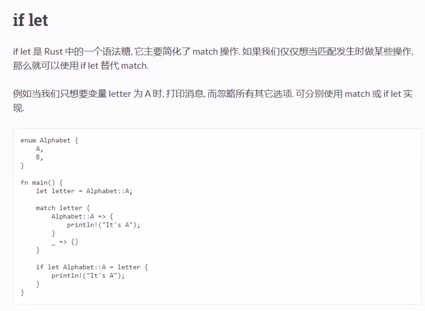
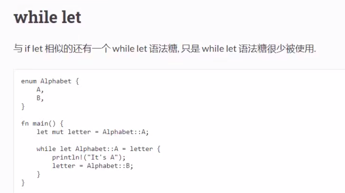

# 表达式的多种形式
> rust是一门表达式语言

 
 
# if-else 
  
```rust
fn main() {
    let n = -1;

    if n>0 {
        println!("{} is positive", n);
    }else if n<0 {
        println!("{} is negative",n);
    }else{
        println!("{} is zero",n);
    }

    let m = if n<0 {
        2.0
    } else {
        3.0
    };
    println!("m = {}",m);
}
```
# loop
 

```rust
fn main() {
    // 1+2+...+100 等差数列
    let mut sum = 0;
    let mut n = 1;
    loop {
        sum += n;
        n += 1;
        if n>100 {
            break
        }
    }
    println!("1+2+...+100 = {}",sum);


    let mut counter = 0;
    let result = loop {
        counter += 1;
        if counter == 10 {
            // break可以有返回值
            // 使用场景：断连 >重试<
            break counter * 2;
        }
    };
    println!("result = {}",result);
}
```
# while
 

```rust
fn main() {
    let mut n = 1;
    while n<101 {
        if n % 15 == 0 {
            println!("fizzbuzz")
        }else if n % 3 == 0 {
            println!("fizz");
        }else if n % 5 ==0 {
            println!("buzz");
        }else{
            println!("{}", n);
        }
        n += 1;
    }
}
```
# for_range
 
 

```rust
fn main() {
    for i in 0..5 {
        println!("{}", i);
    }
    println!("==========");
    for i in 0..=5 {
        println!("{}", i);
    }   
    println!("==========");
    let mut myarr = [1,2,3];
    for i in myarr.iter() {
        println!("{:?}",i);
    } 
    println!("==========");
    for i in myarr.iter_mut() {
        *i *= 2;
        println!("{:?}",i);
    }
    
}
```
# match
```rust
let x = 5;

match x {
    1 => println!("one"),
    2 => println!("two"),
    3 => println!("three"),
    4 => println!("four"),
    5 => println!("five"),
    _ => println!("something else"),
}
```
# if_let
 

```rust
enum Alphabet {
    A,B,C
}
enum Symbol {
    Char(char),
    Number
}
fn main() {
    let letter = Alphabet::A;
    match letter {
        Alphabet::A => {
            println!("It's A");
        }
        _ => {}
    }
    if let Alphabet::A = letter {
        println!("It's A");
    }
    
    let letter2 = Symbol::Char('A');
    if let Symbol::Char(x) = letter2 {
        println!("{:?}", x);
    }
}
```
# while_let
 

```rust
#[derive(Debug)] // 可以被打印
enum Alphabet {
    A,B,C
}
fn main() {
    let mut letter = Alphabet::A;
    while let Alphabet::A = letter {
        println!("{:?}", letter);
        letter = Alphabet::B;
    }
}
```
