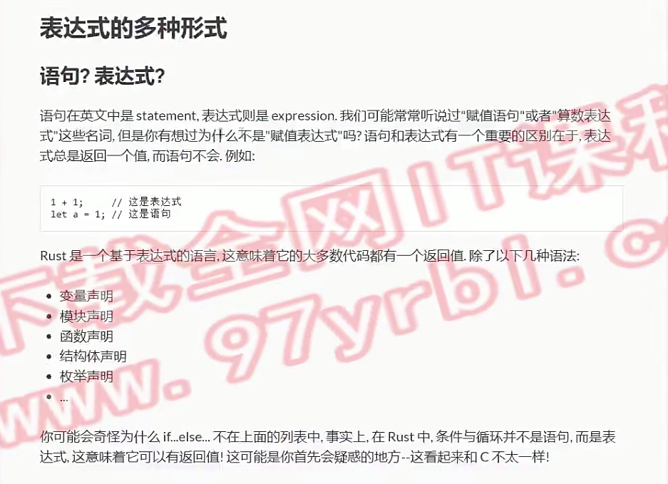

# 表达式的多种形式
> rust是一门表达式语言

 
 
# if-else 
  
```rust
fn main() {
    let n = -1;

    if n>0 {
        println!("{} is positive", n);
    }else if n<0 {
        println!("{} is negative",n);
    }else{
        println!("{} is zero",n);
    }

    let m = if n<0 {
        2.0
    } else {
        3.0
    };
    println!("m = {}",m);
}
```
# loop
 

```rust
fn main() {
    // 1+2+...+100 等差数列
    let mut sum = 0;
    let mut n = 1;
    loop {
        sum += n;
        n += 1;
        if n>100 {
            break
        }
    }
    println!("1+2+...+100 = {}",sum);


    let mut counter = 0;
    let result = loop {
        counter += 1;
        if counter == 10 {
            // break可以有返回值
            // 使用场景：断连 >重试<
            break counter * 2;
        }
    };
    println!("result = {}",result);
}
```
# while
 

```rust
fn main() {
    let mut n = 1;
    while n<101 {
        if n % 15 == 0 {
            println!("fizzbuzz")
        }else if n % 3 == 0 {
            println!("fizz");
        }else if n % 5 ==0 {
            println!("buzz");
        }else{
            println!("{}", n);
        }
        n += 1;
    }
}
```
# for_range
 
 

```rust
fn main() {
    for i in 0..5 {
        println!("{}", i);
    }
    println!("==========");
    for i in 0..=5 {
        println!("{}", i);
    }   
    println!("==========");
    let mut myarr = [1,2,3];
    for i in myarr.iter() {
        println!("{:?}",i);
    } 
    println!("==========");
    for i in myarr.iter_mut() {
        *i *= 2;
        println!("{:?}",i);
    }
    
}
```
# match
```rust
let x = 5;

match x {
    1 => println!("one"),
    2 => println!("two"),
    3 => println!("three"),
    4 => println!("four"),
    5 => println!("five"),
    _ => println!("something else"),
}
```
# if_let
 

```rust
enum Alphabet {
    A,B,C
}
enum Symbol {
    Char(char),
    Number
}
fn main() {
    let letter = Alphabet::A;
    match letter {
        Alphabet::A => {
            println!("It's A");
        }
        _ => {}
    }
    if let Alphabet::A = letter {
        println!("It's A");
    }
    
    let letter2 = Symbol::Char('A');
    if let Symbol::Char(x) = letter2 {
        println!("{:?}", x);
    }
}
```
# while_let
 

```rust
#[derive(Debug)] // 可以被打印
enum Alphabet {
    A,B,C
}
fn main() {
    let mut letter = Alphabet::A;
    while let Alphabet::A = letter {
        println!("{:?}", letter);
        letter = Alphabet::B;
    }
}
```
# 函数与方法

```rust
// 函数
fn fibonacci(n:u64)->u64{
    if n<2{
        n
    }else{
        fibonacci(n-1)+fibonacci(n-2)
    }
}
// 方法是附加在结构体上的函数
#[derive(Debug)]
struct Point{
    x:u64,
    y:u64,
}
impl Point{
    // 构造方法(rust里没有特别区分构造方法，只是约定方法名为new就是构造方法)
    fn new(x:u64,y:u64)->Point{
        Point{x,y}
    }
    fn get_x(&self)->u64{
        self.x
    }
    fn set_x(&mut self,x:u64){
        self.x=x
    }
}
fn main() {
    println!("{:?}",fibonacci(10));
    let mut p = Point::new(10,20);
    println!("{:?}",p);
    println!("{:?}",p.get_x());
    p.set_x(30);
    println!("{:?}",p.get_x());
}
```
# 闭包

```rust
use std::thread;
fn main() {
    let time3=|n:u32|->u32 {n*3};
    println!("{}",time3(10));
    // move: 将环境中的值移动到闭包内部
    // 场景：多线程->从主线程移动值到子线程
    let hello="hello world";
    thread::spawn(move ||{
        println!("{}",hello)
    }).join(); // join：持续等待,直到主线程退出
}
```
# 高阶函数


```rust
type Method = fn(u32,u32)->u32;
// fn calc(method: fn(u32,u32)->u32,a: u32,b: u32)->u32{
fn calc(method: Method,a: u32,b: u32)->u32{
    method(a,b)
}
fn calcFn(method: &str)->Method{
    match method{
        "add"=>add,
        "sub"=>sub,
        _=>unimplemented!() // 未实现
    }
}
fn add(a: u32,b :u32)->u32{
    a+b
}
fn sub(a:u32,b:u32)->u32{
    a-b
}
fn main() {
    println!("{}",calc(add,10,20));
    println!("{}",calc(sub,20,10));
    println!("{}",calcFn("add")(10,20));
    println!("{}",calcFn("sub")(20,10));
}
```
# 发散函数


# 猜数字游戏

```rust
// #![cfg_attr(debug_assertions, allow(dead_code, unused_imports, unused_variables, unused_mut))]
use std::io;
use rand::Rng;
fn main() {
    println!("Guess the number!");
    // rust没有提供生成随机数的内置方法
    let secrete_number:u32 = rand::thread_rng().gen_range(1..101);
    loop{
        // 获取用户输入
        println!("Please input your guess:");
        let mut guess = String::new();
        io::stdin().read_line(&mut guess).unwrap(); // unwrap: 出错直接退出运行
        let guess_number:u32=match guess.trim().parse(){ // parse: 类型转换
            Ok(num)=>num,
            Err(err)=>continue,
        };
        println!("Your guessed: {}", guess_number);
        // 判断大小
        if guess_number>secrete_number{
            println!("to big");
        } else if guess_number<secrete_number{
            println!("to small");
        } else {
            println!("You win!");
            break;
        }
    }
}
```
