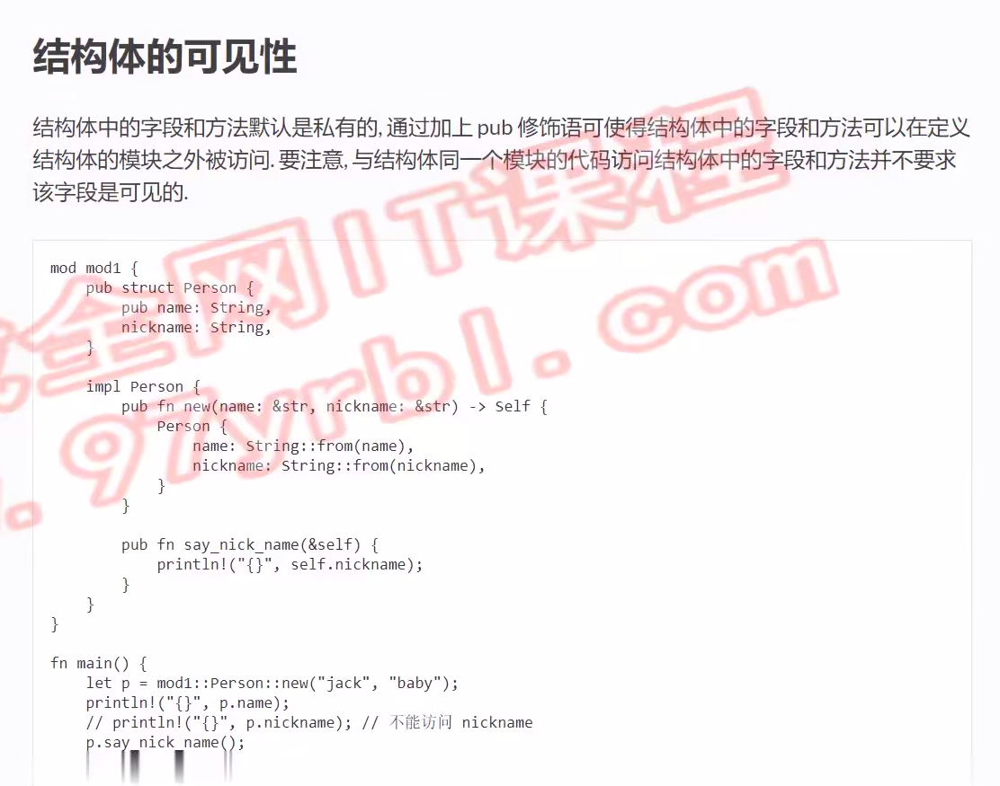

# 结构体的可见性

```rust
mod mod1{
    pub struct Person{
        pub name: String,
        nickname: String,
    }
    impl Person{
        pub fn new(name: &str) -> Self{
            Person{
                name: String::from(name),
                nickname: String::new()
            }
        }
        pub fn set_nickname(&mut self,nickname: &str){
            self.nickname = String::from(nickname);
        }
        pub fn say_nickname(&self){
            println!("{}",self.nickname);
        }
    }
}
fn main() {
    let mut p = mod1::Person::new("jack");
    println!("{}",p.name);
    // println!("{}",p.nickname);
    p.set_nickname("joker");
    p.say_nickname();
}
```
