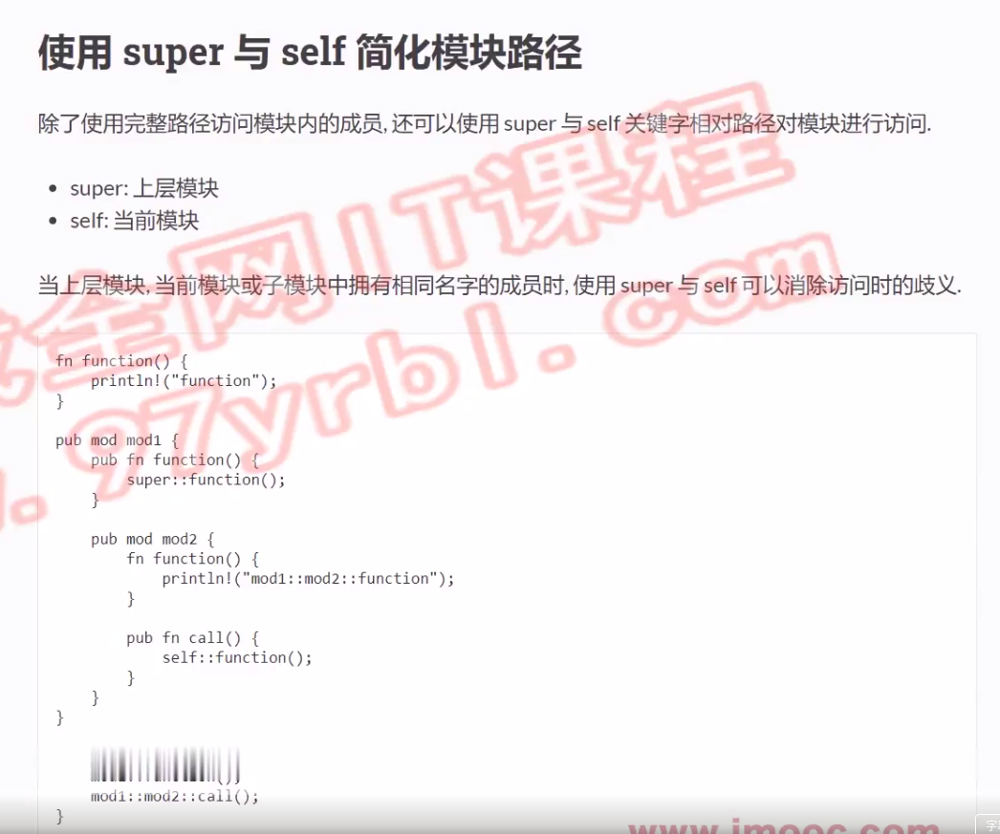

# 使用super与self简化模块路径

```rust
fn function(){
    println!("func");
}
mod mod1{
    pub fn function(){
        super::function();
    }
    pub mod mod2 {
        pub fn function(){
            println!("mod2 func");
        } 
        pub fn call(){
            self::function();
        }
    }
}
fn main() {
    mod1::function();
    mod1::mod2::function();
    mod1::mod2::call();
}
```
