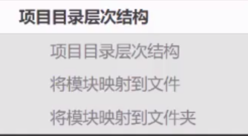

# 项目目录层次结构



## main.rs
```rust
mod mod1; // ./mod1.rs
mod mod2; // ./mod2/mod.rs 
fn main() {
    println!("{}",mod1::MESSAGE);
    println!("{}",mod2::MESSAGE);
    println!("{}",mod2::mod2_a::NUMBER); 
}
```
## mod1.rs
```rust
pub const MESSAGE: &str = "hello world";
```
## mod2
### mod.rs
```rust
pub mod mod2_a;
pub mod mod2_b;
pub const MESSAGE: &str = "hello world mod2";
```
### mod2_a.rs
```rust
pub const NUMBER: u32 = 12;
```