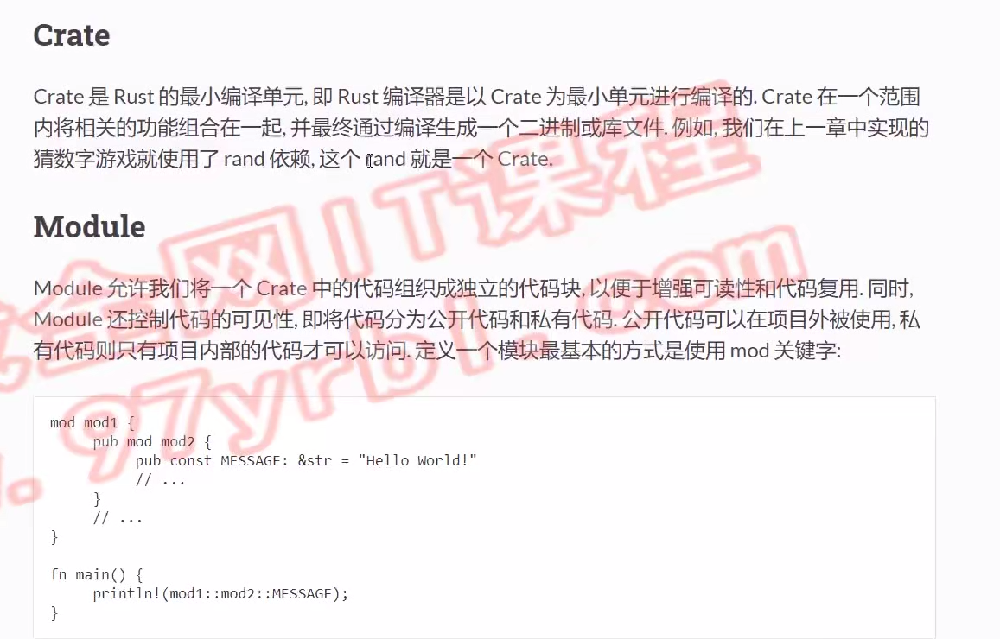
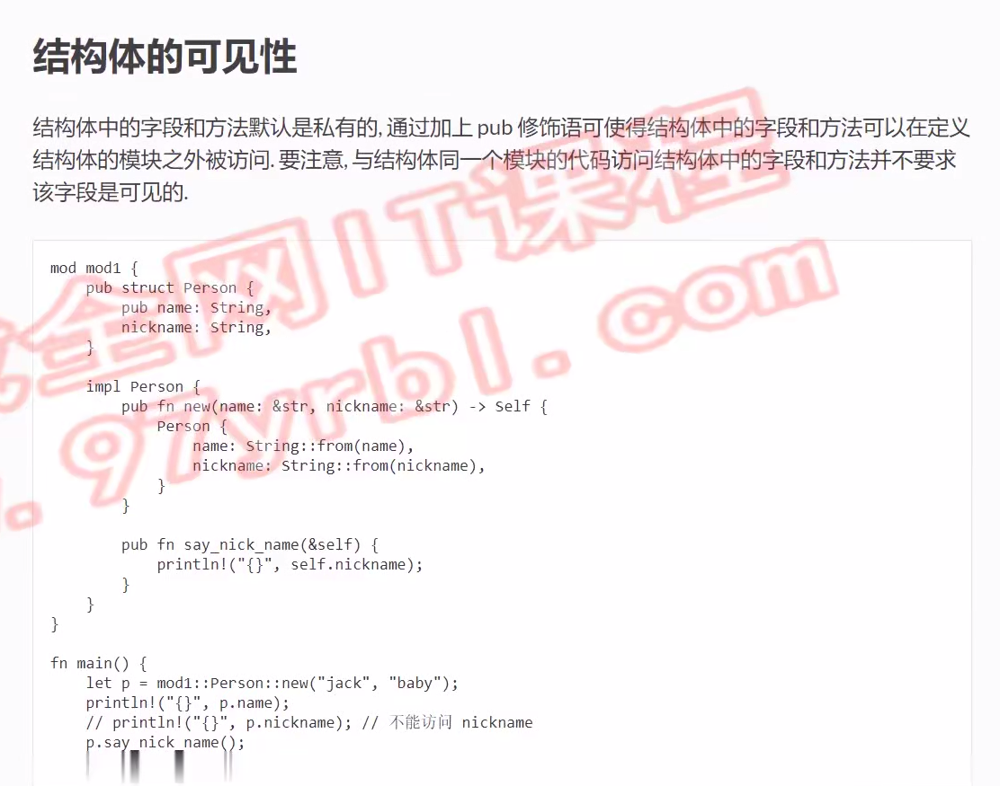
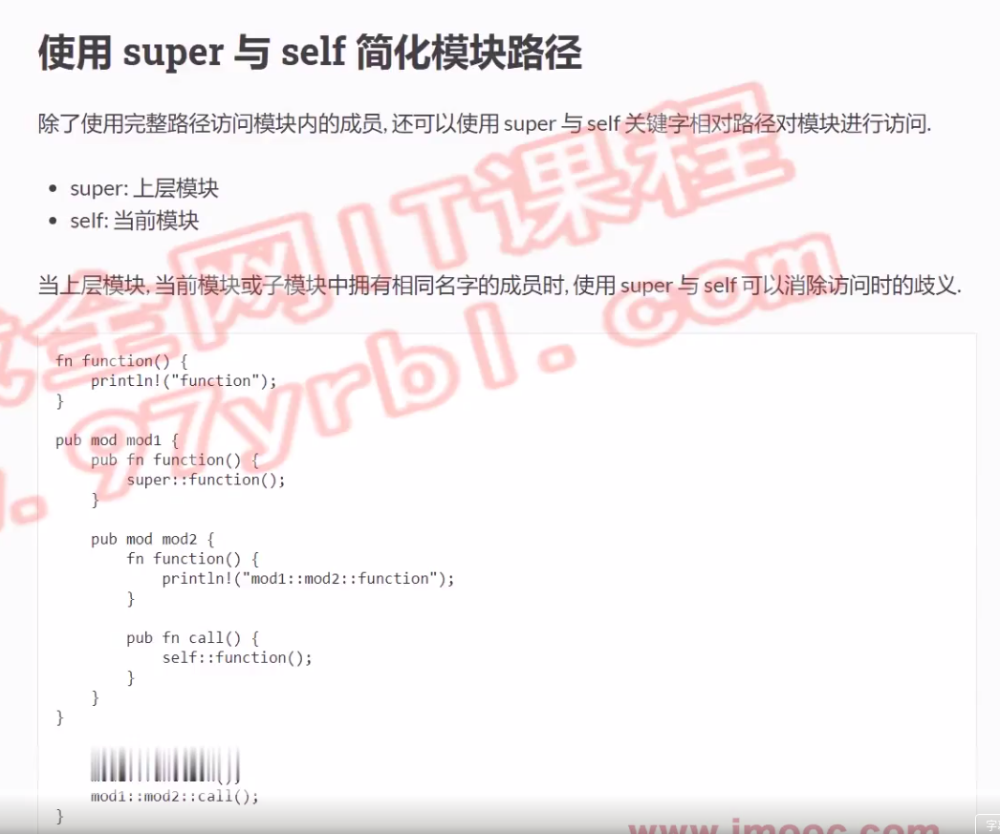
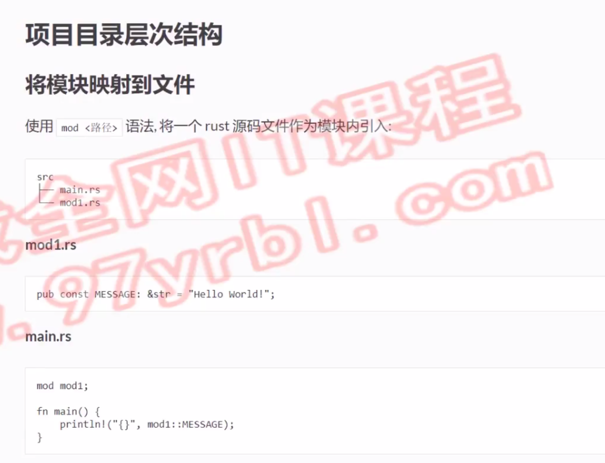
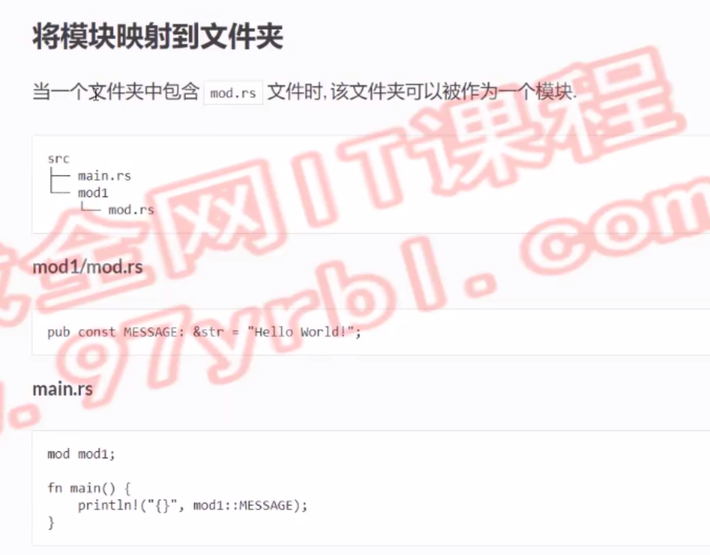
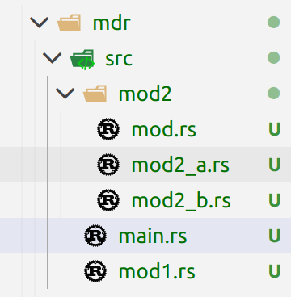

# rust的模块化



# 可见性

```rust
mod mod1{
    pub const MESSAGE: &str = "Hello World!";
    // 就算不加(self),子模块也可以访问
    pub(self) const NUMBER: u32 = 42;
    pub mod mod2{
        pub const MESSAGE: &str = "Hello World!";
        pub fn num(){
            println!("{}", super::NUMBER);
        }
    }
    pub(crate) enum CrateEnum{
        Item = 4
    } 
}
fn main() {
    println!("{}",mod1::MESSAGE);
    println!("{}",mod1::mod2::MESSAGE);
    println!("{}",mod1::CrateEnum::Item as u32);
    mod1::mod2::num();
}
```
# 结构体的可见性

```rust
mod mod1{
    pub struct Person{
        pub name: String,
        nickname: String,
    }
    impl Person{
        pub fn new(name: &str) -> Self{
            Person{
                name: String::from(name),
                nickname: String::new()
            }
        }
        pub fn set_nickname(&mut self,nickname: &str){
            self.nickname = String::from(nickname);
        }
        pub fn say_nickname(&self){
            println!("{}",self.nickname);
        }
    }
}
fn main() {
    let mut p = mod1::Person::new("jack");
    println!("{}",p.name);
    // println!("{}",p.nickname);
    p.set_nickname("joker");
    p.say_nickname();
}
```
# 使用use绑定模块成员
```rust
// use std::fs; // std::fs -> fs
use std::fs as stdfs; // std::fs -> stdfs
fn main() {
    // 打印src/main.rs的内容
    // let data = std::fs::read("src/main.rs").unwrap();
    // let data = fs::read("src/main.rs").unwrap();
    let data = stdfs::read("src/main.rs").unwrap();
    println!("{}",String::from_utf8(data).unwrap());
}
```
# 使用super与self简化模块路径

```rust
fn function(){
    println!("func");
}
mod mod1{
    pub fn function(){
        super::function();
    }
    pub mod mod2 {
        pub fn function(){
            println!("mod2 func");
        } 
        pub fn call(){
            self::function();
        }
    }
}
fn main() {
    mod1::function();
    mod1::mod2::function();
    mod1::mod2::call();
}
```
# 项目目录层次结构




## main.rs
```rust
mod mod1; // ./mod1.rs
mod mod2; // ./mod2/mod.rs 
fn main() {
    println!("{}",mod1::MESSAGE);
    println!("{}",mod2::MESSAGE);
    println!("{}",mod2::mod2_a::NUMBER); 
}
```
## mod1.rs
```rust
pub const MESSAGE: &str = "hello world";
```
## mod2
### mod.rs
```rust
pub mod mod2_a;
pub mod mod2_b;
pub const MESSAGE: &str = "hello world mod2";
```
### mod2_a.rs
```rust
pub const NUMBER: u32 = 12;
```