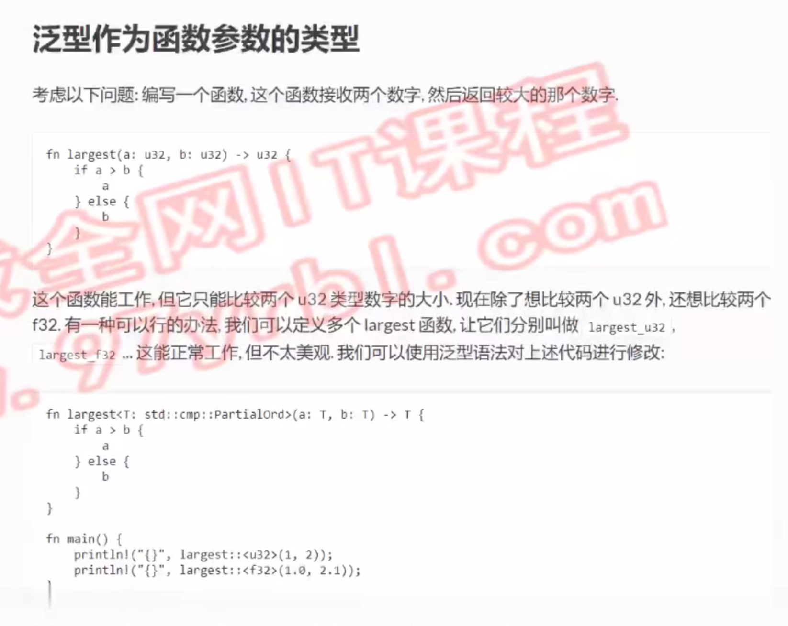

# 泛型作为函数参数的类型

```rust
// T是type的缩写
// std::cmp::PartialOrd （这是一个特征）-> 可比较大小的类型
fn largest<T: std::cmp::PartialOrd>(a: T,b: T)->T{
    if a>b{
        a
    }else {
        b
    }
}
fn main() {
    println!("{}",largest(1,312));
    println!("{}",largest(10.2,20.1));
}
```
