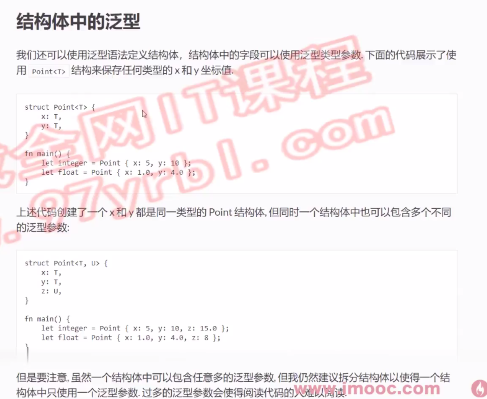
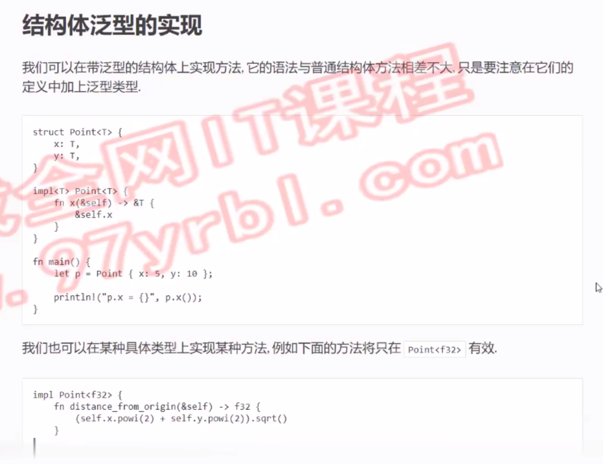
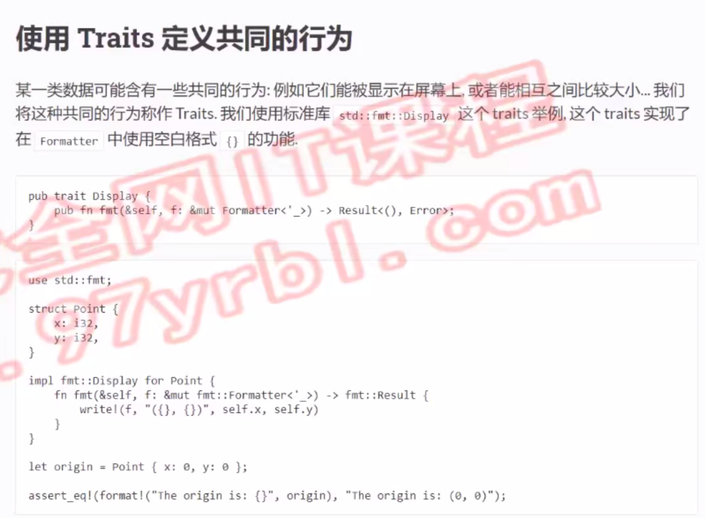
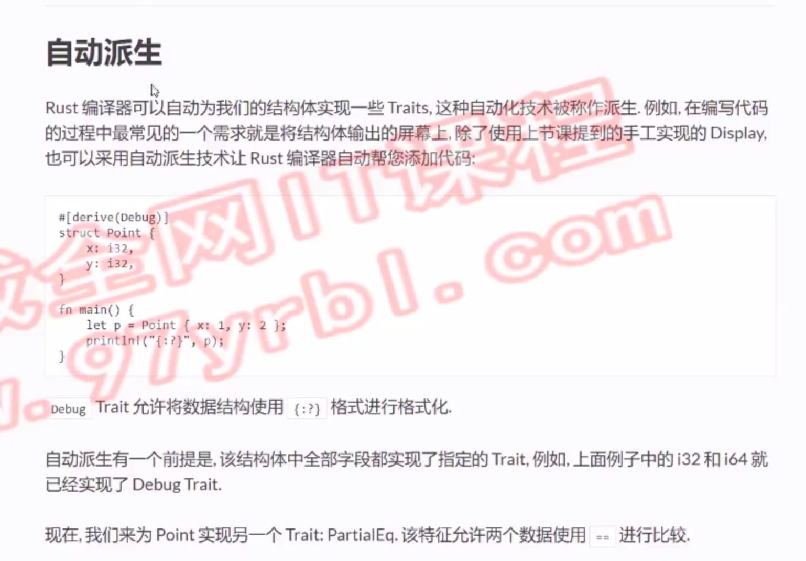

# 泛型作为函数参数的类型

```rust
// T是type的缩写
// std::cmp::PartialOrd （这是一个特征）-> 可比较大小的类型
fn largest<T: std::cmp::PartialOrd>(a: T,b: T)->T{
    if a>b{
        a
    }else {
        b
    }
}
fn main() {
    println!("{}",largest(1,312));
    println!("{}",largest(10.2,20.1));
}
```
# 结构体中的泛型

```rust
struct Point<T>{
    x: T,
    y: T,
}
struct Line<T>{
    x: Point<T>,
    y: Point<T>,
}
fn main() {
    let point1: Point<u32> = Point{x:0,y:0};
    let point2: Point<u32> = Point{x:2,y:2};
    let line: Line<u32> = Line{x:point1,y:point2};
    println!("{} {} {} {}",line.x.x,line.x.y,line.y.x,line.y.y );
}
```
# 带范型的结构体的方法定义

```rust
struct Point<T>{
    x: T,
    y: T,
}
impl<T: Clone + std::cmp::PartialOrd> Point<T>{
    fn largest(&self) -> T {
        if self.x > self.y{
            self.x.clone()
        }else{
            self.y.clone()
        }
    }
}   
// 当泛型为指定类型才实现该方法
impl Point<f32> {
    fn distance_from_origin(&self)->f32{
        // powi -> 求平方
        // sqrt -> 开根号
        (self.x.powi(2)+self.y.powi(2)).sqrt()
    }
}
fn main() { 
    let point = Point{x:10,y:20};
    println!("{:?}",point.largest());
    // println!("{:?}",point.distance_from_origin());

    let point = Point{x:6.0,y:8.0};
    println!("{:?}",point.largest());
    println!("{:?}",point.distance_from_origin());
}
```
# 使用traits定义共同的行为

```rust
struct Point<T>{
    x: T,
    y: T,
}
// 实现格式化输出的接口
impl<T: std::fmt::Display> std::fmt::Display for Point<T>{
    fn fmt(&self,f: &mut std::fmt::Formatter<'_>)->std::fmt::Result{
        write!(f,"({},{})",self.x,self.y)
    }
}
// fn show<T: std::fmt::Display>(a: T){ 
fn show(a: impl std::fmt::Display){ // 语法糖
    println!("show: {}",a)
}
fn main() {
    let point = Point{x: 10,y: 20};
    println!("{}", point);
    show(point);
}
```
# 自动派生

```rust
#[derive(Debug,PartialEq,Default)] // 通过这个，不需要引入，就可以直接使用标准库
struct Point<T>{
    x: T,
    y: T,
}
fn main() { 
    let p1 = Point{x: 10,y: 20}; 
    let p2 = Point{x: 10,y: 20}; 
    println!("{:?}",p1); // 自动派生添加了formatter的traits
    println!("{}",p1==p2);// 自动派生添加了比较traits
    let p:Point<i32> = Point::default();// 自动派生添加了default的traits初始化
    println!("{:?}",p); 
}
```
