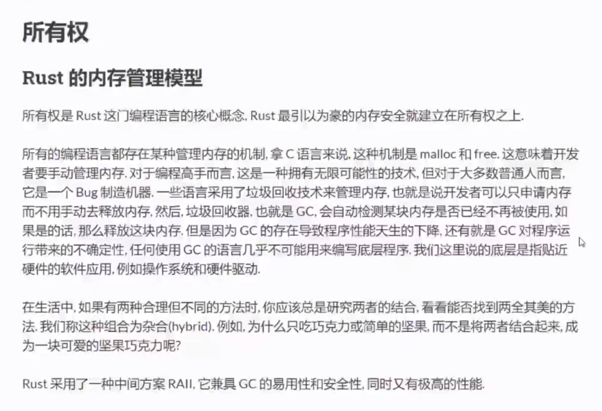
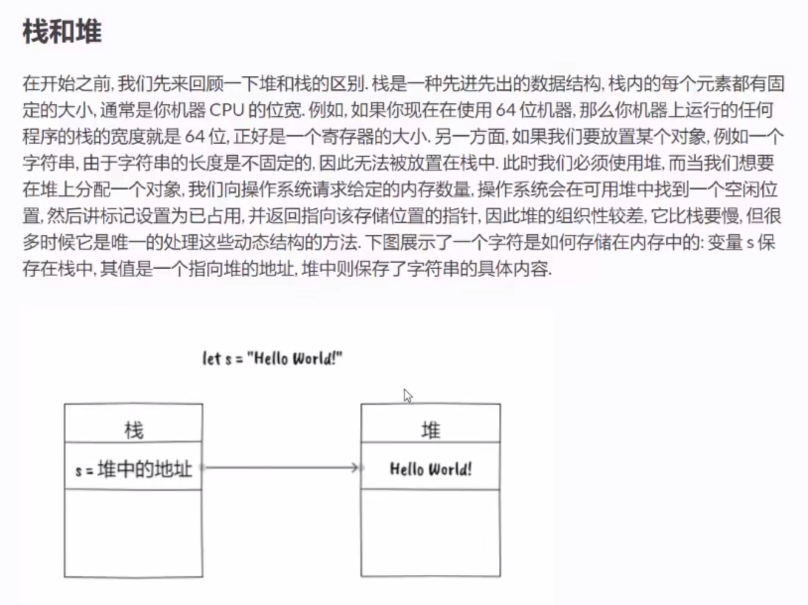

# 所有权


```rust
fn main() {
    // eg.1
    // 存在栈里
    // let s1 = "hello world";
    // 存在堆里
    let s1 = String::from("hello world");
    let s2 = s1;
    // println!("{}", s1); // error: 一个值只能有一个所有者
    println!("{}", s2); 

    // eg.2
    let s2:String;
    {
        let s1 = String::from("hello world");
        s2 = s1; 
        // println!("{}", s1); // error: 所有权转移
    }
    println!("{}", s2); // hello world
}
```
# 借用
